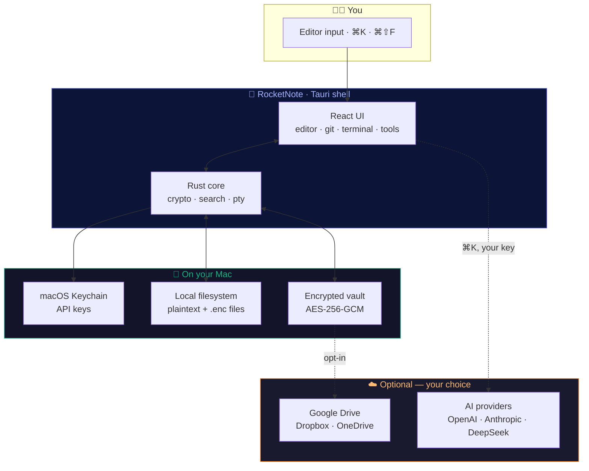
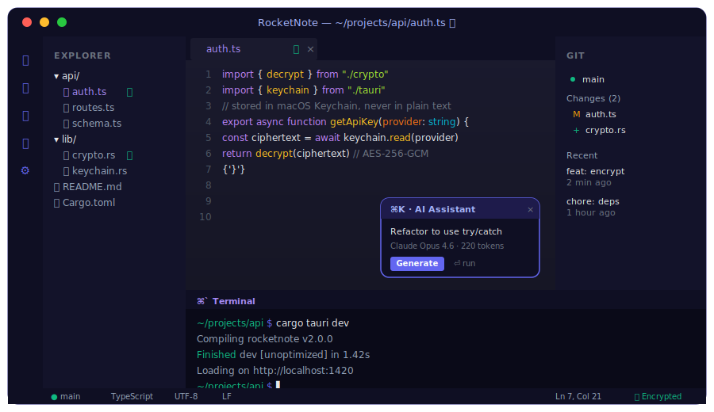

<div align="center">


[](https://github.com/Anic888/rocketnote/releases)
[](#installation)
[](#tech-stack)
[](#military-grade-encryption)
[](LICENSE)
[](#privacy)

**Fast. Private. Local.**

</div>

---

## Why this exists

Most code editors either collect your data or require an internet connection. The good ones that don't (Sublime, BBEdit) miss the modern feel — split panes, fast global search, an AI assistant you can summon with one key. RocketNote is what happens when you build that modern feel on a stack that **can't** spy on you:

- **Zero data collection** — no analytics, no telemetry, no accounts.
- **Military-grade encryption** — AES-256-GCM with Argon2id key derivation. Encrypt any file with one shortcut.
- **100% local** — your files never leave your device unless you choose to sync.
- **Native performance** — Rust + Tauri, not Electron. Cold-starts in milliseconds.

Your API keys live in the macOS Keychain. Your encrypted files can sync to Google Drive / Dropbox / OneDrive — but only as ciphertext, so the cloud provider can't read them. That's the whole product.

---

## What's inside



<div align="center">
  
  <br/>
  <sub><i>Encrypted file open in the editor, AI assistant ready on ⌘K, integrated terminal at the bottom.</i></sub>
</div>

---

## 🚀 Quick start

### Download

Download the latest signed `.dmg` from [Releases](https://github.com/Anic888/rocketnote/releases).

### Build from source

**Prerequisites:** macOS 10.13+, [Node.js](https://nodejs.org/) 18+, [Rust](https://rustup.rs/), Tauri CLI v1

```bash
git clone https://github.com/Anic888/rocketnote.git
cd rocketnote
npm install
cargo install tauri-cli --version "^1"

cargo tauri dev      # development
cargo tauri build    # production .app
```

---

## Key features

### 🔒 Military-grade encryption
- **AES-256-GCM** authenticated encryption
- **Argon2id** key derivation (memory-hard, GPU-resistant)
- Zero-knowledge architecture — even we can't recover your files
- Encrypt any file with a single shortcut

### ☁️ Cloud storage (encrypted sync)
- **Google Drive** — full OAuth integration
- **Dropbox** — upload/download sync
- **OneDrive** — Microsoft cloud support
- Upload **encrypted** files for secure cloud backup — your cloud provider sees only ciphertext

### 🤖 AI assistant (⌘K)

| Provider | Models |
|----------|--------|
| **OpenAI** | GPT-5.4, GPT-5.4 Mini, O3, O4 Mini |
| **Anthropic** | Claude Opus 4.6, Sonnet 4.6, Haiku 4.5 |
| **DeepSeek** | DeepSeek-V3.2, DeepSeek-R1 |

Explain, improve, fix bugs, refactor code — all with your own API key stored in macOS Keychain.

### 📝 Code editor
- Syntax highlighting for 30+ languages
- Minimap with virtualized rendering
- Bracket matching, word wrap, line numbers (absolute & relative)
- Split view and focus mode
- Undo/redo with full history stack

### 🌿 Git integration (⌘⇧G)
- Stage, commit, push, pull
- Branch management (create, switch, delete)
- Diff viewer with line-by-line changes
- Connect to GitHub, GitLab, Bitbucket

### 🔍 Global search (⌘⇧F)
- Lightning-fast parallel search powered by Rayon
- Regex support with case sensitivity and whole-word toggle
- Respects `.gitignore` patterns

### 🔧 Developer tools (12 built-in)

| Tool | Tool |
|------|------|
| JSON Format/Minify | Base64 Encode/Decode |
| URL Encode/Decode | Case Converter (7 formats) |
| Hash (MD5, SHA-256) | UUID v4 Generator |
| Lorem Ipsum | JWT Decoder |
| Timestamp Converter | Color Converter (HEX/RGB/HSL) |
| Regex Tester | Text Diff |

### 💻 Integrated terminal (⌘`)
- Full PTY-based bash/zsh terminal
- Runs in current project directory
- ANSI color support

### And more
- **Coding statistics** — lines, characters, time tracking with 7-day chart
- **Code screenshots** — beautiful syntax-highlighted images
- **Pomodoro timer** — built-in 25/5 productivity timer
- **Code snippets** — save & reuse with tab-stop placeholders
- **Sessions** — save/restore workspace state
- **Bookmarks** — mark lines with F2
- **Format JSON on Save** — auto-formats `.json` files

---

## Keyboard shortcuts

| Action | Shortcut |
|--------|----------|
| New File | ⌘N |
| Open File | ⌘O |
| Open Folder | ⌘⇧O |
| Save | ⌘S |
| Find | ⌘F |
| Global Search | ⌘⇧F |
| AI Assistant | ⌘K |
| Terminal | ⌘` |
| Git Panel | ⌘⇧G |
| Toggle Sidebar | ⌘B |
| Split View | ⌘\ |
| Focus Mode | ⌘⇧↵ |
| Format JSON | ⇧⌥F |
| Bookmark | F2 |
| Settings | ⌘, |

---

## Tech stack

| Layer | Technology |
|-------|-----------|
| Frontend | React 18, TypeScript |
| Backend | Rust, Tauri 1.5 |
| Terminal | portable-pty |
| Encryption | AES-256-GCM, Argon2id |
| Search | Rayon (parallel), ignore (gitignore) |
| Themes | Dark Glass, Ultra Dark, Glassmorphism + Light mode |

---

## Privacy

**We collect nothing.** No analytics, no telemetry, no accounts, no tracking.

- API keys stored in **macOS Keychain** — never in plain text
- AI requests go directly to providers (OpenAI, Anthropic, DeepSeek) — we are not a proxy
- Full privacy policy: [PRIVACY_POLICY.md](PRIVACY_POLICY.md)

---

## Contributing

Contributions are welcome. Please open an [issue](https://github.com/Anic888/rocketnote/issues) or submit a pull request.

See [LICENSE](LICENSE) for the full GPL-3.0 text — your contributions are licensed under the same terms.

---

## License

This project is licensed under the **GNU General Public License v3.0** — see [LICENSE](LICENSE) for details.

---

<div align="center">
  <strong>RocketNote</strong> — <em>Fast. Private. Local.</em>
</div>
